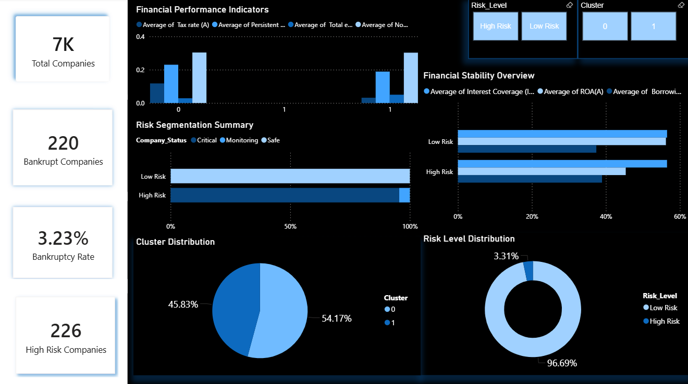
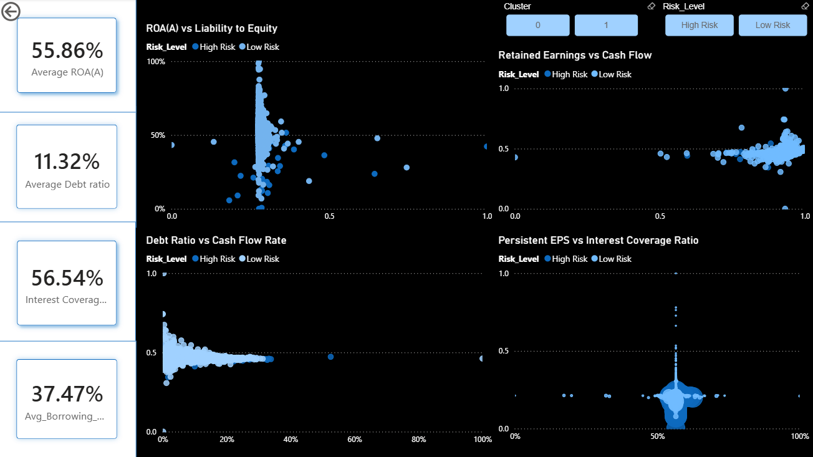
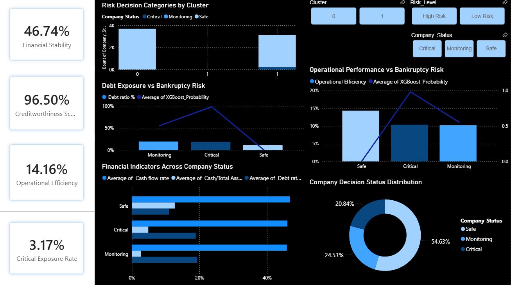
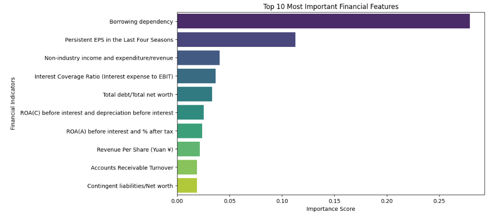
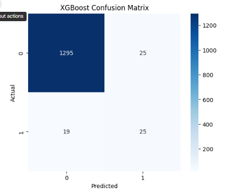
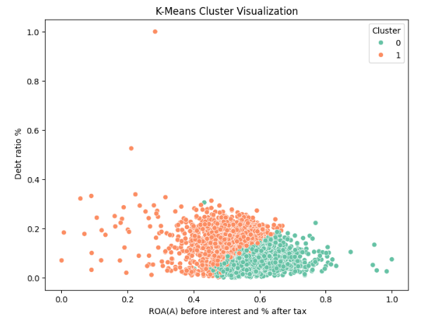

# AI-Based Financial Risk and Bankruptcy Prediction Decision Support System

## Authors
Habeeb Abdullah

ID: 202210158

**Supervised by:**

Dr Ayman Mansour

**Course:** 307498 – Graduation Project  
**Semester:** Second Semester, 2026/2027  
---

## Table of Content
1. [Abstract](#abstract)
2. [Acknowledgment](#acknowledgment)
3. [Business Intelligence Project Description and Objectives](#business-intelligence-project-description-and-objectives)
4. [Data Research and Acquiring Effort](#data-research-and-acquiring-effort)
5. [Data Description and Understanding](#data-description-and-understanding)
6. [Data Primary Cleaning and Transformation](#data-primary-cleaning-and-transformation)
7. [Data Visualization and Insights](#data-visualization-and-insights)
8. [Dashboard Design & Business Insights](#dashboard-design--business-insights)
9. [Advanced Analytics and AI Modeling](#advanced-analytics-and-ai-modeling)
10. [Tools Research and Selection Effort](#tools-research-and-selection-effort)
11. [Project Deployment Effort – Use Case](#project-deployment-effort--use-case)
12. [Results](#results)
13. [References](#references)

---

## Abstract
This project presents an AI-based Financial Risk and Bankruptcy Prediction Decision Support System that integrates Business Intelligence, machine learning, clustering analysis, and interactive data visualization techniques. The study utilizes financial data from Taiwanese companies to analyze financial behavior, assess bankruptcy risk, and support informed financial decision-making.

The project workflow included data preprocessing, exploratory data analysis, statistical testing, feature selection, and class imbalance handling.
 Predictive models were developed using XGBoost and Multi-Layer Perceptron (MLP) Neural Networks, while K-Means clustering was applied to identify financial company segments.
 Interactive dashboards were created in Power BI to transform analytical results into practical decision-support tools.

The results demonstrated strong predictive performance, with XGBoost achieving the best overall bankruptcy prediction capability.
The analysis highlighted the importance of profitability, leverage, debt structure, cash flow performance, and retained earnings in assessing financial risk. Overall, the integration of predictive analytics, clustering, and Business Intelligence provided a comprehensive framework for financial risk assessment and decision support.

---

## Acknowledgment
I would like to express my sincere appreciation to my supervisor and instructors for their guidance, valuable insights, and continuous support throughout the completion of this project. I am also deeply grateful to my family for their unwavering support, patience, and motivation during my academic journey. I would like to thank my friends and colleagues for their support, cooperation, and positive encouragement. In addition, I would like to acknowledge the faculty and staff members whose dedication to education provided a stimulating learning environment.

---

## Business Intelligence Project Description and Objectives
 This project aims to develop an intelligent financial risk analysis and bankruptcy prediction system using Business Intelligence and machine learning techniques. 
 It addresses the corporate finance domain, specifically focusing on real financial data from Taiwanese companies.

 The final outcome is a Decision Support System (DSS) that integrates predictive analytics and interactive visualization to support financial monitoring, bankruptcy risk assessment, and data-driven decision-making.
 The project solves the problem of identifying bankruptcy risk patterns early and evaluating company financial stability. It also addresses analytical challenges such as dealing with highly imbalanced financial datasets.

---

## Data Research and Acquiring Effort
Several financial datasets were reviewed to find one that provides real company financial records, a clearly defined target variable, and a rich set of financial indicators supporting bankruptcy prediction. 

The selected dataset was obtained from the UCI Machine Learning Repository, which is based on data collected from the Taiwan Economic Journal (TEJ) database. It contains 6,819 company records and 96 financial indicators related to profitability, liquidity, leverage, operational efficiency, and financial stability. 

**Raw Data Source:** Taiwanese Bankruptcy Prediction Dataset:
https://archive.ics.uci.edu/dataset/572/taiwanese+bankruptcy+prediction

---

## Data Description and Understanding
**Data Dictionary (Key Indicators):** 
* **ROA(A) before interest and % after tax:** Measures company profitability relative to assets.
* **Current Ratio:** Measures short-term liquidity capability.
* **Debt ratio %:** Measures the percentage of debt financing.
* **Retained Earnings to Total Assets:** Measures accumulated profitability strength.
* **Borrowing dependency:** Indicates dependency on borrowed funds.

**Exploratory Data Analysis (EDA):**
* **Distribution:** The dataset is highly imbalanced, with 6,599 non-bankrupt companies and 220 bankrupt companies.
* **Patterns discovered:** Bankrupt companies generally have higher Liability to Equity values and lower profitability-related indicators compared to non-bankrupt companies
.
* **Relationships found:** The correlation analysis shows that Debt Ratio (%) and Liability to Equity exhibit the strongest positive correlations with bankruptcy risk.
* **Insights:** Leverage-related indicators are important predictors of bankruptcy risk, meaning debt structure and profitability measures are key variables for predictive modeling.

---

## Data Primary Cleaning and Transformation
The dataset was well-structured with no missing values or duplicate records detectdd. The following data preparation steps were applied:
* **Feature Selection/Reduction:** Highly correlated features were identified and removed using a correlation threshold of 0.95 to reduce redundancy, reducing the features from 95 to 79.
* **Train-Test Split:** The dataset was divided into training and testing subsets using an 80/20 stratified sampling split.
* **Data Scaling:** StandardScaler was applied to center features around zero and scale them to a similar range, reducing the influence of different magnitudes.
* **Imbalance Handling:** SMOTE (Synthetic Minority Over-sampling Technique) was applied exclusively to the training data to address the severe class imbalance, resulting in 5,279 observations for both classes.

---

## Data Visualization and Insights
* **Bankruptcy Distribution Analysis (Bar Chart):** Confirms a significant class imbalance, highlighting the need for class balancing techniques.
* **Debt Ratio by Bankruptcy Status (Boxplot):** Shows that bankrupt companies generally have higher debt ratio values than non-bankrupt companies, suggesting greater reliance on debt financing increases bankruptcy likelihood.
* **ROA(A) by Bankruptcy Status (Boxplot):** Indicates that non-bankrupt companies generally have higher ROA(A) values, suggesting stronger profitability is associated with lower risk.
* **Correlation Heatmap:** Reveals that ROA(A) and Retained Earnings have the strongest negative correlations with bankruptcy, while Debt ratio has the strongest positive correlation.

---

## Dashboard Design & Business Insights

**Dashboard 1: Executive Financial Risk Overview**
* **Description:** Provides an executive overview of bankruptcy risk, financial performance, and company segmentation, combining clustering results and risk classification.
* **Insight Derived:** Most companies are classified as Low Risk, and these companies generally demonstrate stronger financial performance and stability.

---

**Dashboard 2: Financial Relationship & Risk Analysis**
* **Description:** Details the relationships between key indicators (e.g., ROA vs Liability to Equity, Debt Ratio vs Cash Flow Rate) and bankruptcy risk across different clusters.
* **Insight Derived:** Companies with stronger profitability and retained earnings exhibit lower financial risk, while higher debt dependence is associated with increased risk.

---

**Dashboard 3: Decision Support & Risk Monitoring**
* **Description:** Combines predictive analytics and company classification (Safe, Monitoring, Critical) to support decision-making and risk monitoring.
* **Insight Derived:** Companies in the Critical category generally exhibit higher bankruptcy risk and weaker financial conditions, making this an effective tool for prioritizing risk.

---

## Advanced Analytics and AI Modeling
* **Model Types:** Built supervised models (XGBoost Classifier and MLP Neural Network) for prediction, and an unsupervised model (K-Means Clustering) for segmentation.
* **Predicted Attribute:** The models aimed to predict bankruptcy risk based on financial indicators.
* **Model Characteristics & Performance:**
  * **XGBoost Classifier:** Achieved an Accuracy of 97%, ROC-AUC Score of 0.946, Precision of 0.50, and Recall of 0.57. 
  * **MLP Neural Network:** Achieved an Accuracy of 96%, ROC-AUC Score of 0.843, Precision of 0.41, and Recall of 0.41.
  * **K-Means Clustering:** Applied with k=2, identifying two primary segments: Cluster 0 (stronger profitability, lower debt) and Cluster 1 (higher leverage, greater risk).
* **Feature Importance:** The XGBoost model identified "Borrowing dependency" as the most influential financial indicator (importance score ~0.279), followed by "Persistent EPS in the Last Four Seasons.

### Model Evaluation & Results (XGBoost)

**1. Feature Importance**

**2. Confusion Matrix**

**3. ROC Curve (AUC = 0.946)**

### Company Segmentation (K-Means)

**4. K-Means Cluster Visualization**

---

## Tools Research and Selection Effort
* **Evaluated & Selected Tools:** Python, Microsoft Power BI, Microsoft Excel, and Google Colab.
* **Reasoning & Support:**
  * **Python:** Selected for its extensive support for data analytics and ML; used for EDA, statistical testing, and model development (using Pandas, Scikit-learn, XGBoost, SMOTE).
  * **Power BI:** Chosen for strong visualization capabilities to develop interactive dashboards and business intelligence reporting.
  * **Google Colab:** Served as the primary development environment, providing cloud-based computational resources for training models.
  * **Excel:** Used for initial dataset inspection and basic organization.

---

## Project Deployment Effort – Use Case
* **Consumption:** A business user will consume this project through an interactive dashboard developed in Power BI.
* **Deployment Process:** A unified dataset was created combining the original financial indicators, the XGBoost bankruptcy predictions, probability scores, risk classifications (High Risk / Low Risk), and K-Means cluster assignments. This dataset was exported as a CSV file to be directly connected to Power BI for interactive decision-support reporting.

---

## Results
The analysis revealed that bankruptcy risk is strongly associated with debt ratio, borrowing dependency, liability-to-equity structure, operational efficiency, cash flow performance, and retained earnings. Financially distressed companies generally exhibited higher leverage and lower profitability compared to healthy ones.

Among the predictive models, XGBoost achieved the best overall performance, demonstrating superior bankruptcy prediction capability and better handling of the imbalanced dataset compared to the MLP Neural Network. K-Means clustering successfully identified two primary financial company groups: financially stable companies (Cluster 0) and financially riskier companies (Cluster 1).

The project demonstrates how AI and Business Intelligence techniques can be integrated into a practical Decision Support System (DSS). The Power BI dashboards transformed analytical results into tools that enable financial risk monitoring, company risk categorization, and data-driven strategic decision-making.

---

## References
* Altman, E. I. (1968). Financial ratios, discriminant analysis and the prediction of corporate bankruptcy. *Journal of Finance, 23*(4), 589–609.
* Power, D. J. (2002). *Decision support systems: Concepts and resources for managers*. Greenwood Publishing Group.
* Dua, D., & Graff, C. (2019). *UCI machine learning repository*. University of California, Irvine, School of Information and Computer Sciences.
* Han, J., Kamber, M., & Pei, J. (2012). *Data mining: Concepts and techniques* (3rd ed.). Morgan Kaufmann.
* Chen, T., & Guestrin, C. (2016). XGBoost: A scalable tree boosting system. *Proceedings of the 22nd ACM SIGKDD International Conference on Knowledge Discovery and Data Mining*, 785–794.
* Haykin, S. (2009). *Neural networks and learning machines* (3rd ed.). Pearson.