# Part 1: Project Overview and Exploratory Data Analysis (EDA)

## Authors
Habeeb Abdullah

ID: 202210158

**Supervised by:**

Dr Ayman Mansour

**Course:** 307498 – Graduation Project  
**Semester:** Second Semester, 2026/2027 

# Abstract
This project presents an AI-based Financial Risk and Bankruptcy Prediction Decision Support System that integrates Business Intelligence, machine learning, clustering analysis, and interactive data visualization techniques. The study utilizes financial data from Taiwanese companies to analyze financial behavior, assess bankruptcy risk, and support informed financial decision-making.

The project workflow included data preprocessing, exploratory data analysis, statistical testing, feature selection, and class imbalance handling. Predictive models were developed using XGBoost and Multi-Layer Perceptron (MLP) Neural Networks, while K-Means clustering was applied to identify financial company segments. In addition, interactive dashboards were created in Power BI to transform analytical results into practical decision-support tools.

The results demonstrated strong predictive performance, with XGBoost achieving the best overall bankruptcy prediction capability. The analysis highlighted the importance of profitability, leverage, debt structure, cash flow performance, and retained earnings in assessing financial risk. Clustering analysis further revealed distinct company groups with different financial behavior patterns and risk characteristics.

Overall, the integration of predictive analytics, clustering, and Business Intelligence provided a comprehensive framework for financial risk assessment, bankruptcy prediction, and decision support. The developed system enables financial monitoring, early risk detection, and data-driven strategic decision-making.

# Acknowledgment
I would like to express my sincere appreciation to my supervisor and instructors for their guidance, valuable insights, and continuous support throughout the completion of this project. Their knowledge, feedback, and encouragement contributed significantly to the successful development of this work and enriched my understanding of Business Intelligence, Data Analytics, and Artificial Intelligence applications.

I am also deeply grateful to my family for their unwavering support, patience, and motivation during my academic journey. Their encouragement provided me with the determination and confidence needed to overcome challenges and achieve my goals.

I would like to thank my friends and colleagues for their support, cooperation, and positive encouragement throughout the project. Their assistance and shared experiences made this journey both productive and enjoyable.

In addition, I would like to acknowledge the faculty and staff members whose dedication to education and academic excellence provided a stimulating learning environment that fostered growth, innovation, and critical thinking. Finally, I extend my gratitude to everyone who contributed, directly or indirectly, to the completion of this project. Your support and encouragement have played an important role in both my academic achievements and personal development.

# Business Intelligence Project Description and Objectives

## Project Description and Goal
This project aims to develop an intelligent financial risk analysis and bankruptcy prediction system using Business Intelligence and machine learning techniques. The analysis is based on real financial data from Taiwanese companies and focuses on identifying bankruptcy risk patterns, evaluating financial performance, and supporting financial decision-making. The study utilizes key financial indicators related to profitability, leverage, liquidity, growth, and financial stability.

Several analytical approaches were applied, including exploratory data analysis, statistical testing, machine learning, clustering analysis, and interactive dashboard visualization. Python and Google Colab were used for data preprocessing, statistical analysis, and predictive modeling, while Microsoft Power BI was used to develop interactive dashboards and business intelligence visualizations.

The project evaluates the ability of machine learning models to predict bankruptcy risk, compares financial behavior among companies, and applies clustering techniques to identify groups with similar financial characteristics. The final outcome is a Decision Support System (DSS) that integrates predictive analytics and interactive visualization to support financial monitoring, bankruptcy risk assessment, and data-driven decision-making (Power, 2002).

## Project Objectives
The main objectives of this project are:
* Analyze financial indicators associated with bankruptcy risk and company financial stability.
* Perform exploratory data analysis to understand financial patterns and relationships between variables.
* Apply statistical testing methods to compare financial behavior between high-risk and low-risk companies.
* Build a bankruptcy prediction model using XGBoost machine learning algorithm.
* Develop a deep learning model using MLP Neural Network for performance comparison.
* Apply K-Means clustering to segment companies according to financial risk characteristics.
* Identify the most important financial features affecting bankruptcy prediction.
* Compare model performance using evaluation metrics such as Accuracy, Recall, F1-Score, and ROC-AUC.
* Design interactive Power BI dashboards to support financial analysis and business decision-making.
* Develop a financial decision support system that combines predictive analytics and Business Intelligence visualization.

# Data Research and Acquiring Effort
The dataset used in this project was obtained from the UCI Machine Learning Repository and is based on financial data collected from the Taiwan Economic Journal (TEJ) database.

***Dataset Source:** https://archive.ics.uci.edu/dataset/572/taiwanese+bankruptcy+prediction

The dataset contains 6,819 company records and 96 financial indicators related to profitability, liquidity, leverage, operational efficiency, and financial stability. It also includes a bankruptcy label, making it suitable for predictive modeling, statistical analysis, clustering, and Business Intelligence applications.

Several financial datasets were reviewed before selecting the final dataset. This dataset was chosen because it provides real company financial records, a clearly defined target variable, and a rich set of financial indicators that support bankruptcy prediction and financial risk analysis. Although the data originates from Taiwanese companies, the financial indicators used are widely recognized in financial analysis and can be applied to organizations in different countries where similar financial data is available. However, prediction results and financial behavior patterns may vary across economic environments and regulatory frameworks.

The dataset is publicly available through the UCI Machine Learning Repository (Dua & Graff, 2019).

# Data Description and Understanding

## Dataset Preview & Shape
The dataset contains 6819 rows and 96 columns. The dataset appears to contain complete records with no significant missing values.

**Observation:** The dataset contains 6819 rows and 96 columns, providing sufficient financial indicators for bankruptcy prediction analysis. The dataset contains many financial indicators related to company profitability, liquidity, debt structure, operational efficiency, and financial stability.

## Important Financial Indicators Description
The table below summarizes key financial indicators used in this project. Financial ratios are widely used to evaluate company performance and bankruptcy risk (Altman, 1968).

| Financial Indicator | Description |
| :--- | :--- |
| ROA(A) before interest and % after tax | Measures company profitability relative to assets. |
| ROA(B) before interest and depreciation after tax | Measures profitability after depreciation effects. |
| ROA(C) before interest and taxes before depreciation | Measures operational profitability before taxes and depreciation. |
| Operating Gross Margin | Indicates operational profitability before expenses. |
| Realized Sales Gross Margin | Measures actual profit generated from sales. |
| Operating Profit Rate | Measures profit generated from operations. |
| Net Profit before Tax | Represents company profit before taxes. |
| Net Income to Total Assets | Measures profitability relative to total assets. |
| Total Asset Growth Rate | Indicates company asset growth over time. |
| Current Ratio | Measures short-term liquidity capability. |
| Quick Ratio | Measures liquidity excluding inventory. |
| Working Capital to Total Assets | Measures short-term financial stability. |
| Cash Flow Rate | Measures cash flow performance efficiency. |
| Cash Flow to Sales | Indicates the relationship between sales and cash flow. |
| Debt Ratio % | Measures the percentage of debt financing. |
| Liability to Equity | Measures liabilities relative to shareholder equity. |
| Total Debt to Total Net Worth | Measures debt relative to net worth. |
| Borrowing Dependency | Indicates dependency on borrowed funds. |
| Retained Earnings to Total Assets | Measures accumulated profitability strength. |
| Inventory Turnover Rate | Measures inventory management efficiency. |

Financial ratios are widely used to evaluate company performance and bankruptcy risk (Altman, 1968).

---

# Exploratory Data Analysis (EDA)
Exploratory Data Analysis (EDA) was conducted to understand the dataset structure, quality, distribution, and financial patterns before model development.

Exploratory Data Analysis (EDA) was conducted to understand the dataset structure, quality, distribution, and financial patterns before model development.

The following analyses were performed:

*   Statistical Summary Analysis
*   Feature Distribution Analysis
*   Outlier Analysis
*   List item
*   Correlation Analysis
*   Financial Comparison by Bankruptcy Status
*   Pivot Table Analysis
*   Statistical Testing (T-Tests)

These analyses helped identify financial patterns and indicators related to bankruptcy risk.

## Data Primary Cleaning and Transformation
Initial data validation and cleaning were performed to assess dataset quality before preprocessing and model development.

The dataset was well-structured, with no significant missing values, duplicate records, or formatting issues. Therefore, only minimal preprocessing was required

Minimal preprocessing steps were applied to support exploratory analysis and predictive modeling.

## Missing Values Check
Checks for missing values in the dataset.

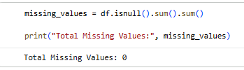

### Observation

No missing values were detected in the dataset, indicating clean and complete financial records.

## Duplicate Values Check

Checks for duplicate records in the dataset.

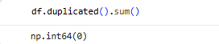

### Observation
No duplicate records were found in the dataset, indicating clean and consistent financial data.

## Selected Financial Indicators
The following financial indicators were selected because they represent important aspects of financial performance, liquidity, profitability, cash flow, and debt structure.
These indicators were used to analyze financial behavior and bankruptcy risk patterns.

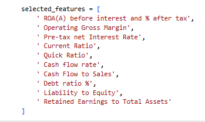

## Statistical Summary Analysis

Provides statistical summaries of the selected financial indicators.

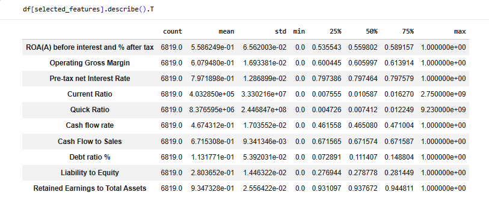

**Observation:** 

The statistical results show noticeable variation across several financial indicators. Some variables, especially liquidity-related indicators, contain large value ranges and potential outliers. Profitability and debt-related indicators also vary across companies, reflecting differences in financial performance and bankruptcy risk. These findings support the need for preprocessing techniques such as scaling before model training.

## Bankruptcy Distribution Analysis

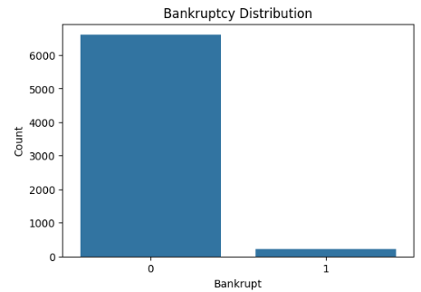

**Observation:** The dataset is highly imbalanced, with 6,599 non-bankrupt companies and 220 bankrupt companies. The visualization confirms a significant class imbalance, as non-bankrupt companies greatly outnumber bankrupt companies. This pattern reflects real-world financial datasets and highlights the need for class balancing techniques during model development.

## Feature Distribution Analysis

Explores the distribution of selected financial indicators to better understand data behavior and variability.

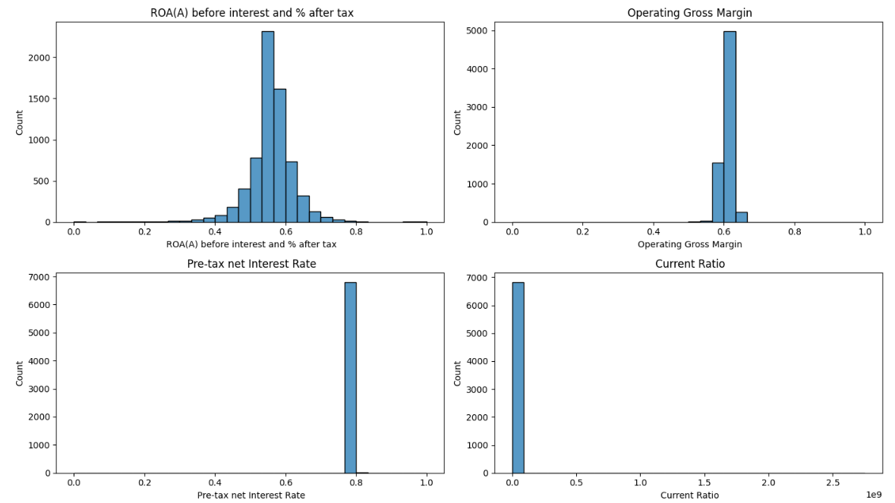

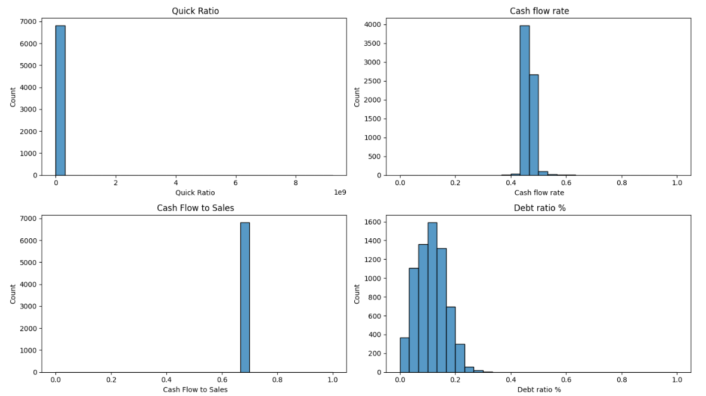

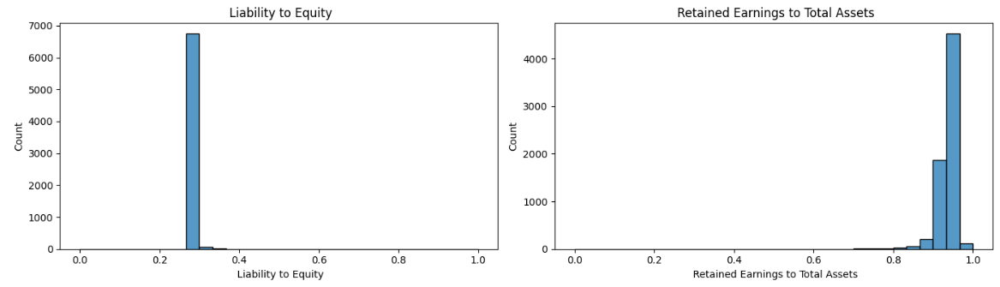

**Observation:** 

The distributions show different patterns across the selected financial indicators. Liquidity-related variables such as Current Ratio and Quick Ratio appear highly skewed and contain extreme values, while profitability measures are more concentrated around their central values. These findings indicate the presence of outliers and support the need for preprocessing before model development.

## Outlier Analysis

Examines whether the selected financial indicators contain extreme values that may affect statistical analysis and model performance.

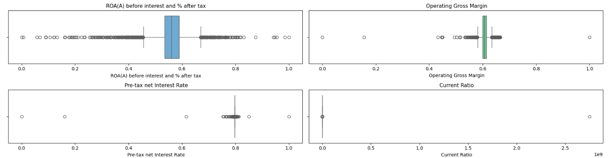

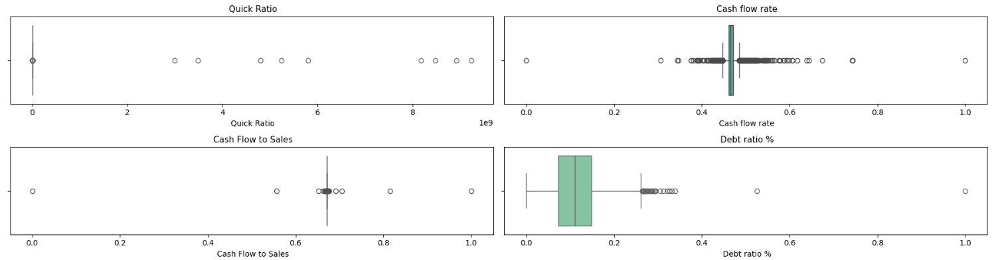

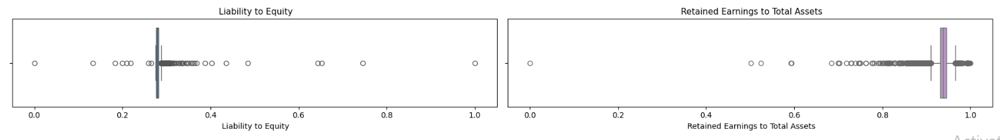

**Observation:** 

The boxplots reveal the presence of outliers across multiple financial indicators, especially liquidity and debt-related variables. These observations may influence model performance and support the use of preprocessing techniques such as scaling and imbalance handling.

These outliers were not removed directly because they may represent financially distressed companies or unusual financial conditions that are important for bankruptcy prediction analysis (Han, Kamber, & Pei, 2012).

## Correlation Analysis and Feature Relationships

Correlation Heatmap
This step analyzes the linear relationships between selected financial indicators and bankruptcy risk.

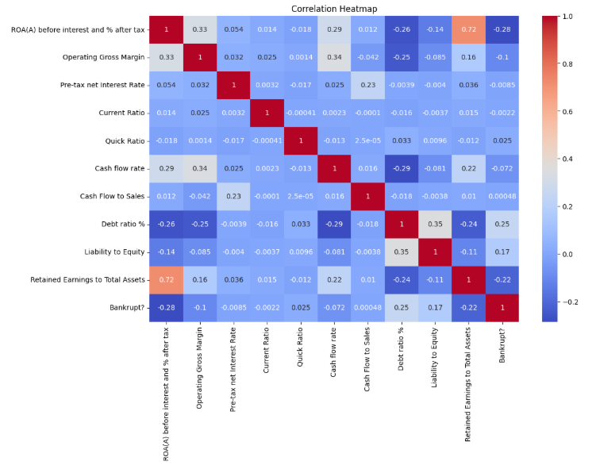

## Correlation Ranking:

The following step ranks financial indicators based on their correlation strength with bankruptcy risk.

* Debt ratio % : 0.250161
* Liability to Equity : 0.166812
* Quick Ratio : 0.025058
* Cash Flow to Sales : 0.000479
* Current Ratio : -0.002211
* Pre-tax net Interest Rate : -0.008517
* Cash flow rate : -0.072356
* Operating Gross Margin : -0.100043
* Retained Earnings to Total Assets : -0.217779
* ROA(A) before interest and % after tax : -0.282941

**Observation:** 

The correlation analysis shows that most financial indicators have weak to moderate relationships with bankruptcy risk. Debt Ratio (%) and Liability to Equity exhibit the strongest positive correlations with bankruptcy, while ROA(A) before interest and % after tax and Retained Earnings to Total Assets show the strongest negative correlations. These results suggest that companies with higher debt levels are more likely to face bankruptcy, whereas profitable companies with stronger retained earnings tend to have lower bankruptcy risk.

Business Insight
The findings indicate that leverage-related indicators are important predictors of bankruptcy risk. Therefore, debt structure and profitability measures should be considered key variables during predictive model development.

## Financial Comparison by Bankruptcy Status

A comparative analysis was conducted to examine differences in selected financial indicators between bankrupt and non-bankrupt companies. Boxplots were used to identify patterns and variations associated with bankruptcy risk.

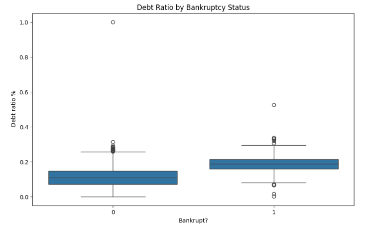

**Observation:** 

The boxplot shows that bankrupt companies generally have higher debt ratio values than non-bankrupt companies. This suggests that greater reliance on debt financing may increase financial risk and the likelihood of bankruptcy. A number of outliers are present in both groups, indicating variability in company debt structures.

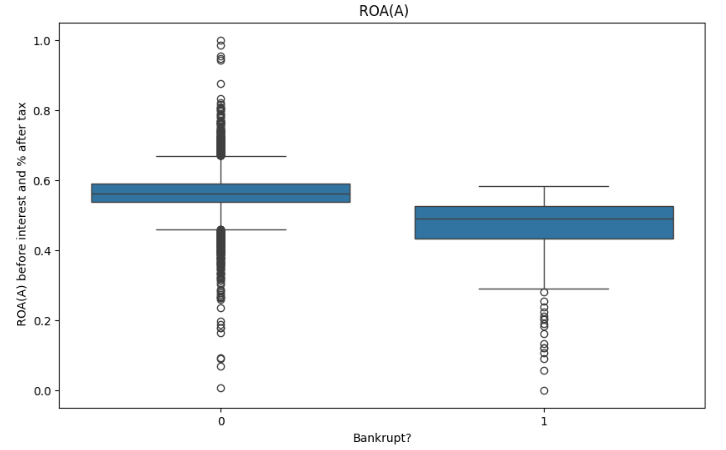

**Observation:** 

The results indicate that non-bankrupt companies generally have higher ROA(A) values than bankrupt companies. This suggests that stronger profitability and more efficient asset utilization are associated with lower bankruptcy risk, while lower profitability may signal financial distress.

## Financial Indicator Summary by Bankruptcy Status:

This step summarizes selected financial indicators for bankrupt and non-bankrupt companies to support financial insight generation.

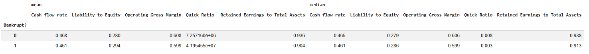

The summary table shows that bankrupt companies generally have higher Liability to Equity values and lower profitability-related indicators compared to non-bankrupt companies. Non-bankrupt firms exhibit stronger Operating Gross Margin, Cash Flow Rate, and Retained Earnings to Total Assets, suggesting better financial stability and lower bankruptcy risk.

**Bankruptcy Distribution Across Debt Categories:**

* Low Debt: 99.69% Non-Bankrupt, 0.31% Bankrupt
* Medium Debt: 98.90% Non-Bankrupt, 1.10% Bankrupt
* High Debt: 91.73% Non-Bankrupt, 8.27% Bankrupt

**Observation:** The results show that bankruptcy cases become more frequent as debt levels increase. The High Debt category has the highest bankruptcy percentage (8.27%), compared with 1.10% in the Medium Debt category and 0.31% in the Low Debt category. This suggests that higher financial leverage is associated with greater bankruptcy risk.

## Statistical Testing
This section applies statistical testing methods to determine whether the differences between bankrupt and non-bankrupt companies are statistically significant. The independent samples T-test was used to compare the mean values of both groups.

**Hypotheses:**
* **H₀:** There is no statistically significant difference between bankrupt and non-bankrupt companies.
* **H₁:** There is a statistically significant difference between bankrupt and non-bankrupt companies.

**T-Test Results:**
* **ROA(A):** T-Statistic: -24.356 | P-Value: 1.03e-125
* **Debt Ratio %:** T-Statistic: 21.332 | P-Value: 8.37e-98
* **Current Ratio:** T-Statistic: -0.182 | P-Value: 0.855
* **Cash Flow Rate:** T-Statistic: -5.989 | P-Value: 2.20e-09

**Result Interpretation:**

The T-test results indicate statistically significant differences in ROA(A), Debt Ratio %, and Cash Flow Rate between bankrupt and non-bankrupt companies (p < 0.05). In contrast, Current Ratio does not show a statistically significant difference (p > 0.05). These findings suggest that profitability, leverage, and cash flow measures are more strongly associated with bankruptcy risk than Current Ratio in this dataset.

### Dataset Challenges Identified During Analysis
Several challenges were identified during the exploratory analysis process:
* The dataset is highly imbalanced because bankrupt companies represent a small percentage of the data.
* Several financial indicators contain outliers and extreme values.
* Some financial relationships appear to be nonlinear and complex.
* The dataset contains many financial variables, which increases model complexity.

These challenges will be addressed during preprocessing and model development stages.

# Data Visualization and Insights

## Dashboard Design & Business Insights

Interactive Power BI dashboards were developed to visualize financial risk patterns and support Decision Support System (DSS) objectives.Additional analytical indicators were created based on the results of exploratory analysis, clustering, and predictive modeling to provide clear and actionable bankruptcy risk indicators.

## Dashboard 1 — Executive Financial Risk Overview

### Dashboard Purpose

This dashboard provides an executive overview of bankruptcy risk, financial performance, and company segmentation. It combines financial indicators, clustering results, and risk classification outputs to support financial risk assessment and decision-making.

### Dashboard Components

• KPI Cards: Display total companies, bankrupt companies, bankruptcy rate, and high-risk companies.

• Financial Performance Indicators: Compare key financial metrics across different risk groups.

• Risk Segmentation Summary: Shows the distribution of companies between High Risk and Low Risk categories.

• Financial Stability Overview: Compares financial stability indicators across risk levels.

• Cluster Distribution: Presents the proportion of companies within each cluster generated by K-Means clustering.

• Risk Level Distribution: Displays the percentage of High Risk and Low Risk companies.

• Filters and Slicers: Enable interactive exploration by Risk Level and Cluster.

### Business Insights

• Most companies are classified as Low Risk, while only a small proportion are considered High Risk.

• Bankrupt companies represent a small percentage of the dataset, indicating class imbalance.

• Low-risk companies generally demonstrate stronger financial performance and financial stability.

• Clustering results reveal distinct financial behavior patterns among companies.

• The dashboard supports early identification of financially distressed companies and enhances financial risk monitoring and decision-making.

## Dashboard 2 — Financial Relationship & Risk Analysis

### Dashboard Purpose

This dashboard provides a detailed analysis of the relationships between key financial indicators and bankruptcy risk. It helps identify financial behavior patterns, compare risk groups, and support bankruptcy risk assessment through interactive visual exploration.

### Dashboard Components

• KPI Cards: Display average values of ROA(A), Debt Ratio, Interest Coverage Ratio, and Borrowing Dependency.

• ROA(A) vs Liability to Equity: Examines the relationship between profitability and financial leverage across risk groups.

• Retained Earnings vs Cash Flow: Analyzes the connection between retained earnings and cash flow performance.

• Debt Ratio vs Cash Flow Rate: Evaluates how debt levels relate to companies' cash flow positions.

• Persistent EPS vs Interest Coverage Ratio: Explores the relationship between earnings stability and the ability to cover interest obligations.

• Filters and Slicers: Allow users to interactively explore results by Risk Level and Cluster.

### Business Insights

• Companies with stronger profitability and retained earnings generally exhibit lower financial risk.

• Higher debt dependence and leverage tend to be associated with increased bankruptcy risk.

• Cash flow indicators provide additional insight into a company's financial stability and ability to manage obligations.

• The visualizations reveal distinct financial behavior patterns between risk groups.

• The dashboard supports deeper investigation of financial relationships and assists in identifying factors associated with corporate financial distress.

## Dashboard 3 — Decision Support & Risk Monitoring

### Dashboard Purpose

This dashboard supports decision-making and financial risk monitoring by combining predictive analytics, company classification, and financial performance indicators. It helps identify financially vulnerable companies and prioritize risk management actions.

### Dashboard Components

• KPI Cards: Display Financial Stability, Creditworthiness Score, Operational Efficiency, and Critical Exposure Rate.

• Risk Decision Categories by Cluster: Shows the distribution of companies classified as Safe, Monitoring, and Critical across clusters.

• Debt Exposure vs Bankruptcy Risk: Compares debt ratio levels with predicted bankruptcy risk probabilities.

• Operational Performance vs Bankruptcy Risk: Examines the relationship between operational efficiency and bankruptcy risk.

• Financial Indicators Across Company Status: Compares key financial indicators such as cash flow rate, retained earnings, and debt ratio across decision categories.

• Company Decision Status Distribution: Displays the proportion of companies classified as Safe, Monitoring, and Critical.

• Filters and Slicers: Allow interactive analysis by Cluster, Risk Level, and Company Status.

### Business Insights

• Most companies are classified as Safe, while smaller proportions fall into Monitoring and Critical categories.

• Companies in the Critical category generally exhibit higher bankruptcy risk and weaker financial conditions.

• Higher debt exposure is associated with increased financial risk and potential financial distress.

• Stronger operational performance is generally linked to lower bankruptcy risk.

• The dashboard provides an effective decision-support tool for identifying high-risk companies, monitoring financial health, and prioritizing risk mitigation efforts.

# Data Preprocessing
This section prepares the dataset for machine learning and deep learning models by removing highly correlated features, scaling the data, handling class imbalance, and splitting the dataset into training and testing sets.

## 1. Remove Temporary Categorical Analysis Column
A temporary column (Debt_Category) created during exploratory analysis was removed before model development.

**Observation:** 

The final dataset contains only variables intended for model training, helping maintain a clean and consistent feature set.

## 2. Correlation-Based Feature Reduction
Highly correlated features were identified and removed using a correlation threshold of 0.95. This threshold was selected to eliminate only extremely redundant variables while preserving most of the financial information contained in the dataset.

**Observation:** 

The number of features was reduced from 95 to 79, resulting in a more compact dataset while retaining the key financial indicators required for bankruptcy prediction.

## 3. Train-Test Split
The dataset was divided into training and testing subsets using stratified sampling.

**Observation:** 

An 80/20 split was applied, with 80% of the data used for training and 20% for testing. This provided sufficient data for model training while maintaining reliable model evaluation.

## 4. Feature Scaling
StandardScaler was applied because the financial indicators have different scales and ranges. Standardization helps improve the performance of machine learning algorithms that are sensitive to feature magnitude.

**Observation:** The transformed features were centered around zero and scaled to a similar range, reducing the influence of differences in feature magnitudes during model training.

## 5. Handling Imbalanced Data
SMOTE (Synthetic Minority Over-sampling Technique) was applied to address the severe class imbalance in the bankruptcy dataset and improve the model's ability to learn patterns from bankrupt companies.

### Class Distribution Comparison Before & After Imbalance Handling
* **Before SMOTE:** 5,279 non-bankrupt vs. 176 bankrupt
* **After SMOTE:** 5,279 non-bankrupt vs. 5,279 bankrupt

**Observation:** 

Before SMOTE, the training dataset was highly imbalanced, containing 5,279 non-bankrupt companies and 176 bankrupt companies. After applying SMOTE, both classes contained 5,279 observations, resulting in a perfectly balanced training dataset. SMOTE was applied only to the training data to prevent information leakage and ensure fair model evaluation. Although the training data was balanced, the original dataset remains dominated by non-bankrupt companies, reflecting real-world bankruptcy distributions.

## 6. Final Dataset Shapes
* **X_train_balanced:** (10558, 79)
* **y_train_balanced:** (10558,)
* **X_test:** (1364, 79)
* **y_test:** (1364,)

**Observation:** 

The preprocessing pipeline produced a balanced training dataset with 10,558 observations and 79 features, while the test dataset retained 1,364 observations and 79 features for unbiased model evaluation.

# Advanced Analytics and AI Modeling

## Modeling Methodology

Different machine learning and deep learning techniques were applied to analyze bankruptcy risk from multiple perspectives. The selected models were chosen based on the dataset characteristics, including nonlinear financial relationships, class imbalance, and the large number of financial indicators.

##Supervised Models

### 1. XGBoost Classifier

XGBoost was selected because it performs efficiently on structured financial datasets and can capture complex nonlinear relationships between financial indicators and bankruptcy risk. It is also robust to outliers and suitable for imbalanced classification problems (Chen & Guestrin, 2016).

### 2. MLP Neural Network

The MLP Neural Network was used to evaluate deep learning performance on financial data. The model can learn complex interactions among financial variables and identify hidden nonlinear patterns that may not be captured by traditional machine learning methods (Haykin, 2009).

## Unsupervised Model

### 3. K-Means Clustering

K-Means clustering was applied to group companies with similar financial characteristics. The technique helps identify hidden financial patterns and supports risk segmentation by separating companies into different financial risk groups.

## Classification Evaluation Metrics

• Accuracy

• Precision

• Recall

• F1-Score

• ROC-AUC Score

• Confusion Matrix

### Observation

The combination of supervised and unsupervised techniques provides a comprehensive analysis of bankruptcy risk. Classification models focus on predicting bankruptcy, while clustering helps identify hidden financial risk patterns and company segments.

### Prediction Analysis

This section presents the machine learning and deep learning models developed to predict bankruptcy risk. The models were trained using the preprocessed financial dataset and evaluated using multiple classification metrics.

## XGBoost Classifier

### Model Training & Prediction

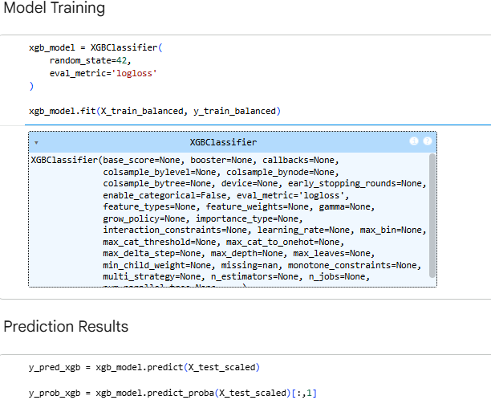

### Model Evaluation

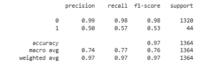

### Confusion Matrix

### ROC Curve & AUC Score

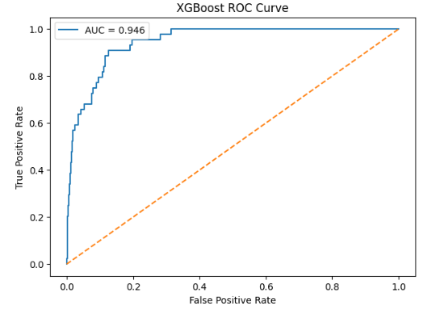

### Financial Feature Importance Analysis

**Top 10 most influential features:**
* Borrowing dependency → 0.2792 (most important)
* Persistent EPS in the Last Four Seasons → 0.1129
* Non-industry income and expenditure/revenue → 0.0407
* Interest Coverage Ratio (Interest expense to EBIT) → 0.0367
* Total debt/Total net worth → 0.0336
* ROA(C) before interest and depreciation before interest → 0.0255
* ROA(A) before interest and % after tax → 0.0239
* Revenue Per Share (Yuan ¥) → 0.0218
* Accounts Receivable Turnover → 0.0192
* Contingent liabilities/Net worth → 0.0191

### XGBoost Model Analysis

The XGBoost model was trained using the balanced financial dataset to predict bankruptcy risk based on multiple financial indicators.

### Model Performance

The model achieved strong classification performance:

Accuracy: 97%

ROC-AUC Score: 0.946

Precision: 0.50

Recall: 0.57

F1-Score: 0.53

These results indicate that the model was highly effective in distinguishing between bankrupt and non-bankrupt companies despite class imbalance challenges.

### Confusion Matrix Analysis

The confusion matrix results showed:

True Negatives: 1295

False Positives: 25

False Negatives: 19

True Positives: 25

The model demonstrated strong capability in identifying financially stable companies while maintaining moderate bankruptcy detection performance.

### Feature Importance Analysis

The most influential financial indicator was Borrowing Dependency with an importance score of approximately 0.279.

Other important indicators included:

Persistent EPS in the Last Four Seasons

Interest Coverage Ratio

Total Debt to Total Net Worth

ROA(A)

ROA(C)

These findings suggest that debt dependency, profitability, and earnings stability are major factors associated with bankruptcy risk.

### Overall Interpretation

The XGBoost model achieved strong classification performance with 97% accuracy and an ROC-AUC score of 0.946. The results indicate that debt dependency, profitability, and earnings stability are among the most influential factors associated with bankruptcy risk.